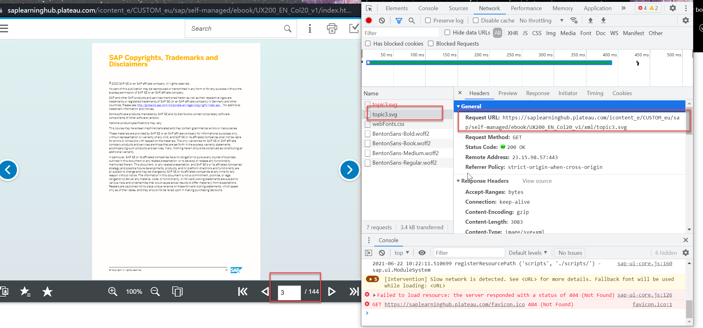

# LearningHubPdfSpider
PDF Spider for Learning Hub 

**实现过程：**
1. 用Chrome，通过LearningHub找到对应的PDF，登录saplearninghub后，在独立窗口中打开的Ebook页面，F12查看对应某页PDF的URL和header里的cookie。
   
2. 复制URL的里bookName，header里的token，最大页数，对应修改main.py里： bookName、headers和allPage。
3. ~~创建下载所需的文件目录，复制result下的demo文件夹，并重命名为上一步的{bookName}。~~
4. 运行main.py，逐页下载svg格式的文档并保存本对应的文件件下，转换成PDF并保存。可修改curPage，实现“断点续传”。
5. 所有页面下载完成后，会自动通过mergePDF(),合并PDF。合并后的pdf，不加密，可复制，可标注，无目录。

**ATTITION：**
所有文档均使用登录用户的Cookie下载，有可能会包含个人信息，下载的文档**不要外传**，仅限个人学习使用！

**Tops：**
1. Main.py包含svglib等依赖，需要手动pip下载并导入（可使用Pycharm来方便导入）。
2. Python推荐使用Pycharm来编辑、运行。