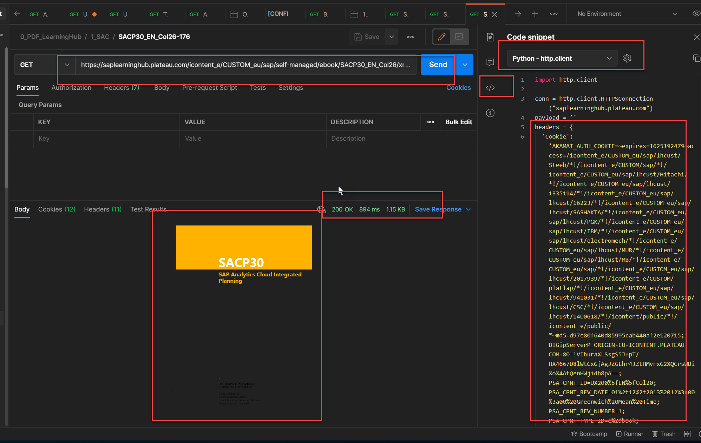

# LearningHubPdfSpider
PDF Spider for Learning Hub 

**实现过程：**
1. 用Chrome，通过LearningHub找到对应的PDF，登录saplearninghub后，F12查看对应某页PDF的URL。
   
2. Chrome安装并打开Postman Interceptor插件。
3. 登录LearningHub并运行Interceptor之后，在Postman里打开PDF的URL，通过Postman Interceptor，获取Python代码所需要的Cookie。（注意，要使用最新的“安装版”Postman，不要使用Chrome版。）(也可使用Chrome-F12的Cookie？可能是格式问题？放到Python里没成功，没继续研究)
   
4. 复制Cookie到main.py，并修改对应PDF的URL： urlTopic、bookName、curPage和allPage，运行后，逐页下载svg格式的文档并保存本对应的文件件下，转换成PDF并保存。可修改curPage，实现“断点续传”。
5. 所有页面下载完成后，通过mergePDF(),合并后的PDF，不加密，可复制，可标注，无目录。

**ATTITION：**
所有文档均使用登录用户的Cookie下载，有可能会包含个人信息，下载的文档**不要外传**，仅限个人学习使用！

**Tops：**
1. Main.py包含svglib等依赖，需要手动pip下载并导入。
2. Python推荐使用Pycharm来编辑、运行。